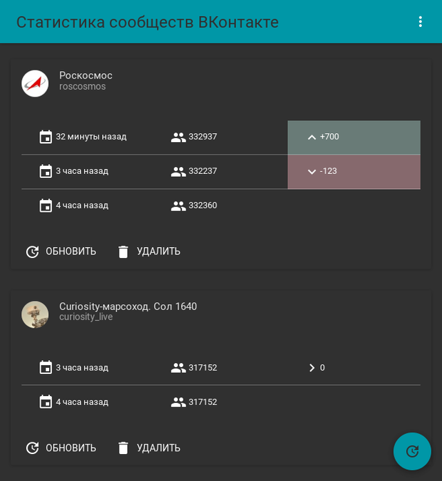
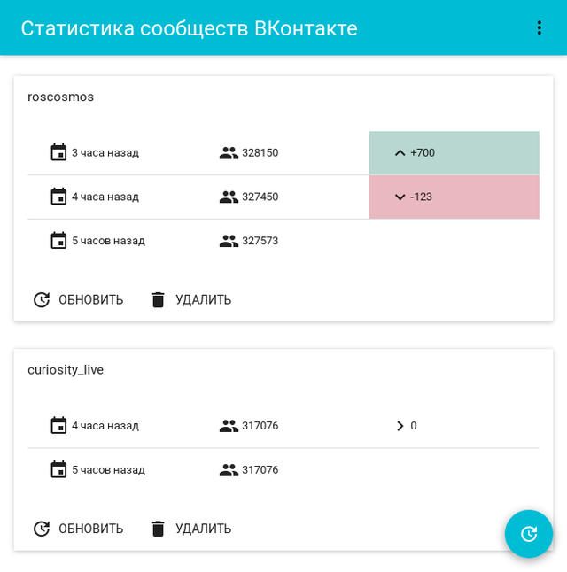
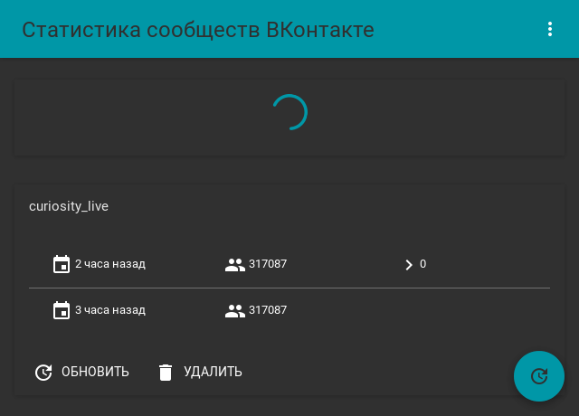
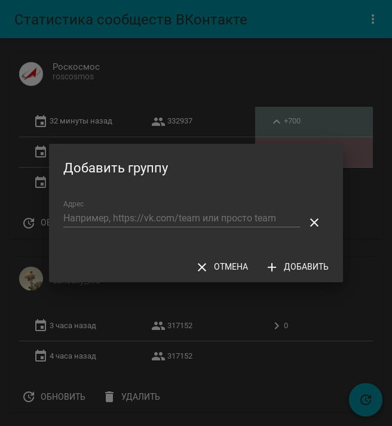
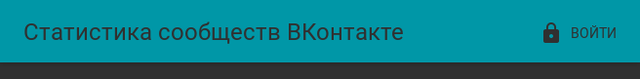
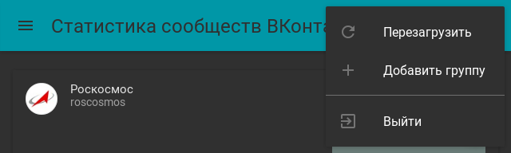

# VK Group Stats

Service for a collecting of a [VK](http://vk.com/) groups stats.

## Technologies

* ECMAScript 2015;
* back-end:
    * Node.js;
    * Express;
    * MongoDB;
* front-end:
    * Redux;
    * React;
    * Material-UI.

## Features

* back-end:
    * authentication:
        * an authentication via [VK](http://vk.com/);
        * support of a skipping of an authentication;
    * users:
        * data:
            * MongoDB ObjectId;
            * [VK](http://vk.com/) ID;
        * operations:
            * getting of a current user;
            * automatically addition on an authentication;
        * support of a fake user on a skipping of an authentication;
    * groups:
        * data:
            * MongoDB ObjectId;
            * user ObjectId;
            * [VK](http://vk.com/) screen name;
        * operations (for a current user):
            * getting of all;
            * addition of one;
            * deletion of one;
    * counters:
        * data:
            * MongoDB ObjectId;
            * group ObjectId;
            * addition timestamp;
            * group members counter;
        * operations (for a specified group):
            * getting of all in a descending order;
            * getting of all in a descending order beginning with a specified timestamp;
            * addition of one (automatically via [VK](http://vk.com/) API);
            * deletion of all;
    * automatically addition of counters via [VK](http://vk.com/) API for all added groups by schedule;
* front-end:
    * design:
        * adaptive;
        * material:
            * dark;
            * light;
    * group list:
        * displays:
            * groups;
        * states:
            * fetching;
            * success;
            * failure;
        * for every group:
            * displays:
                * [VK](http://vk.com/) screen name;
                * counters for a last day;
            * states:
                * fetching;
                * success;
                * failure;
            * for every counter:
                * displays:
                    * timestamp;
                    * number of subscribers;
                    * delta compared to a previous;
    * dialogs:
        * add group dialog;
        * about app dialog;
    * group list refreshing;
    * authentication:
        * login;
        * logout.

## Installation

Install Node.js v6+: https://nodejs.org/en/download/package-manager/

Install MongoDB Community Edition v3.4+: https://docs.mongodb.com/manual/installation/

Clone this repository:

```
$ git clone https://github.com/thewizardplusplus/vk-group-stats.git
$ cd vk-group-stats
```

Install dependencies:

```
$ npm install
```

Build the project (with the dark theme by default):

```
$ npm run build
```

To use the light theme, build the project with the `REACT_APP_USE_LIGHT_THEME` environment variable set to `TRUE`:

```
$ REACT_APP_USE_LIGHT_THEME=TRUE npm run build
```

Create the [VK](http://vk.com/) website app: https://vk.com/dev/first_guide?f=2.%20Application%20registration

Its authorized redirect URI must be in the format: `http[s]://<domain>/authentication/vk/callback`.

Set environment variables in the `.env.prod` file in the project root and rename it to `.env`:

```
$ nano .env.prod
$ mv .env.prod .env
```

## Update

Pull updates from the repository:

```
$ cd vk-group-stats
$ git pull --rebase origin master
```

Install new dependencies:

```
$ npm install
```

Rebuild the project (with the dark theme by default):

```
$ npm run build
```

To use the light theme, rebuild the project with the `REACT_APP_USE_LIGHT_THEME` environment variable set to `TRUE`:

```
$ REACT_APP_USE_LIGHT_THEME=TRUE npm run build
```

## Usage

```
$ npm start
```

Environment variables:

* `NODE_ENV` &mdash; the current environment (allowed: `production`);
* `REACT_APP_USE_LIGHT_THEME` &mdash; use the light theme (it's accepted only during the build time; `TRUE` to an use);
* `PORT`, `VK_GROUP_STATS_SERVER_PORT` &mdash; the server port (default: 4000);
* `VK_GROUP_STATS_SERVER_URI` &mdash; the server URI (default: `http://localhost[:<port>]/`);
* `VK_GROUP_STATS_SESSION_SECRET` &mdash; the sessions secret (default: a random UUID v4);
* `MONGODB_URI`, `VK_GROUP_STATS_MONGODB_URI` &mdash; the MongoDB connection URI (default: `mongodb://localhost/vk-group-stats`);
* `VK_GROUP_STATS_VK_APP_ID` &mdash; the [VK](http://vk.com/) app ID;
* `VK_GROUP_STATS_VK_APP_SECRET` &mdash; the [VK](http://vk.com/) app secure key;
* `VK_GROUP_STATS_SKIP_AUTHENTICATION` &mdash; skip an authentication (`TRUE` to a skip);
* `VK_GROUP_STATS_SCHEDULING` &mdash; scheduling settings (use the cron utility format; default: `0 0 * * *`, i.e. once every day).

Environment variables can be specified in a `.env` file in the project root in the format:

```
NAME_1=value_1
NAME_2=value_2
...
```

See details about the format: https://github.com/motdotla/dotenv#rules

A `.env` file will never modify any environment variables that have already been set.

## Deploy on [Heroku](https://www.heroku.com/)

Create a new Heroku personal app: https://dashboard.heroku.com/new?org=personal-apps

Add to it mLab MongoDB add-on: https://elements.heroku.com/addons/mongolab

Install Heroku CLI: https://devcenter.heroku.com/articles/heroku-cli

Login to a Heroku account:

```
$ heroku login
```

Clone this repository:

```
$ git clone https://github.com/thewizardplusplus/vk-group-stats.git
$ cd vk-group-stats
```

Create a Heroku remote:

```
$ heroku git:remote -a <heroku-personal-app-name>
```

Deploy the code:

```
$ git push heroku master
```

Set up environment variables for a deployed app:

```
$ heroku config:set VK_GROUP_STATS_SERVER_URI=<heroku-personal-app-uri>
$ heroku config:set VK_GROUP_STATS_SESSION_SECRET=...
$ heroku config:set VK_GROUP_STATS_VK_APP_ID=...
$ heroku config:set VK_GROUP_STATS_VK_APP_SECRET=...
```

## API

API description in the [Swagger](http://swagger.io/) format: [docs/api.yaml](docs/api.yaml).

## Redux state

Redux state in the JSON Schema format: [docs/state.json](docs/state.json).

## Screenshots



Group list (with the dark theme)



Group list (with the light theme)



Fetching state


Failure state



Add group dialog



Main menu (unauthorized)



Main menu (authorized)

## License

The MIT License (MIT)

Copyright &copy; 2017 thewizardplusplus
