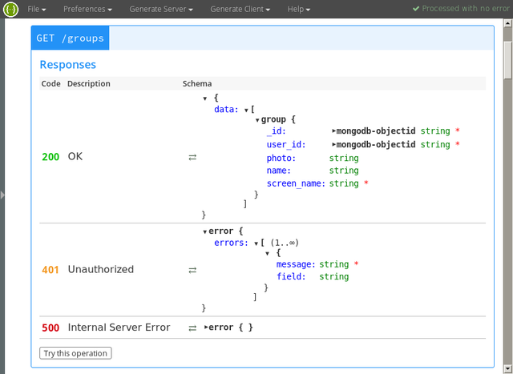
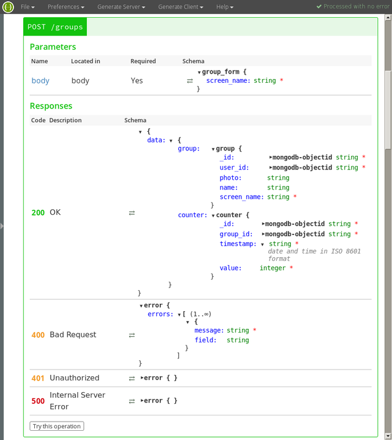
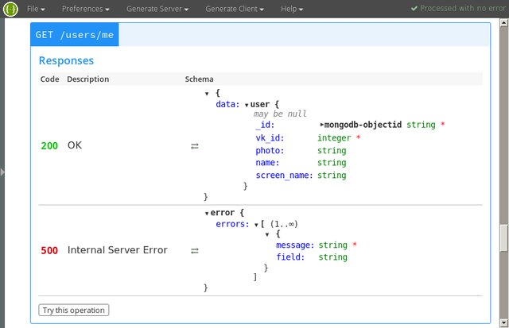

# VK Group Stats

Service for a collecting of a [VK](http://vk.com/) groups stats.

## Technologies

* ECMAScript 2015;
* back-end:
    * Node.js;
    * Express;
    * MongoDB;
* front-end:
    * Redux;
    * React;
    * Material-UI.

## Features

* an authentication via [VK](http://vk.com/);
* users:
    * data:
        * MongoDB ObjectId;
        * [VK](http://vk.com/) ID;
    * operations:
        * getting of a current user;
        * automatically addition on an authentication;
* groups:
    * data:
        * MongoDB ObjectId;
        * user ObjectId;
        * [VK](http://vk.com/) screen name;
    * operations (for a current user):
        * getting of all;
        * addition of one;
        * deletion of one;
* counters:
    * data:
        * MongoDB ObjectId;
        * group ObjectId;
        * addition timestamp;
        * group members counter;
    * operations (for a specified group):
        * getting of all in a descending order;
        * getting of all in a descending order beginning with a specified timestamp;
        * addition of one (automatically via [VK](http://vk.com/) API);
        * deletion of all;
* automatically addition of counters via [VK](http://vk.com/) API for all added groups by schedule.

## Usage

```
$ npm start
```

Environment variables:

* `NODE_ENV` &mdash; the current environment (allowed: `production`);
* `VK_GROUP_STATS_SERVER_PORT` &mdash; the server port (default: 4000);
* `VK_GROUP_STATS_MONGODB_HOST` &mdash; the MongoDB host (default: `localhost`);
* `VK_GROUP_STATS_MONGODB_DATABASE` &mdash; the MongoDB database (default: `vk-group-stats`);
* `VK_GROUP_STATS_MONGODB_PORT` &mdash; the MongoDB port (default: 27017);
* `VK_GROUP_STATS_SESSION_SECURE` &mdash; use secure sessions (`TRUE` to an use);
* `VK_GROUP_STATS_SESSION_SECRET` &mdash; the sessions secret (default: a random UUID v4);
* `VK_GROUP_STATS_VK_APP_ID` &mdash; the [VK](http://vk.com/) app ID (default: 5878021);
* `VK_GROUP_STATS_VK_APP_SECRET` &mdash; the [VK](http://vk.com/) app secret;
* `VK_GROUP_STATS_VK_APP_CALLBACK` &mdash; the [VK](http://vk.com/) app callback for an authentication (default: `http://localhost:4000/authentication/vk/callback`);
* `VK_GROUP_STATS_SCHEDULING` &mdash; scheduling settings (use the cron utility format; default: `0 0 * * *`, i.e. once every day).

## API

API description in the [Swagger](http://swagger.io/) format: [docs/api.yaml](docs/api.yaml).

## Screenshots



`GET /groups`



`POST /groups`


`DELETE /groups/{group_id}`


`GET /groups/{group_id}/counters`


`POST /groups/{group_id}/counters`


`DELETE /groups/{group_id}/counters`



`GET /users/me`

## License

The MIT License (MIT)

Copyright &copy; 2017 thewizardplusplus
